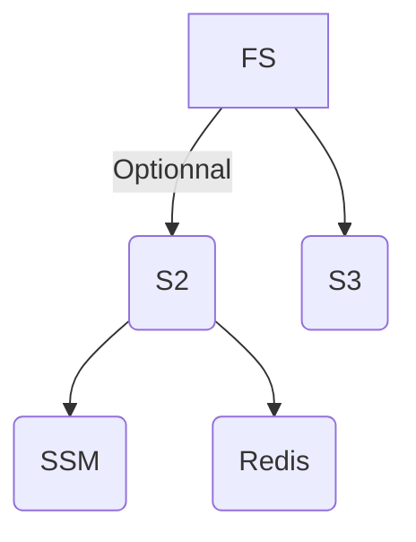

# FS

---

# Description

FS (File System) is a micro-service for handling files. It serves both as an interface for S3 storage and SSM.

Each and every file uploaded to this service are saved within S3. Optionally, it is possible to hash and send some of those files into an SSM.

# Architecture

The communication with the S3 storage is done via a [MinIO](https://docs.min.io/docs/java-client-quickstart-guide.html) SDK, which can communicate with any S3-compatible API.

The communication with the SSM is done with an event-sourcing S2 automate and uses Redis as a cache.



# Getting Started

FS is designed to be deployed as a standalone micro-service.
A docker image can be found [here](https://hub.docker.com/repository/docker/smartbcity/fs-gateway) and used in a docker-compose:

```yaml
version: "3.7"
services:
  fs-gateway:
    container_name: fs-gateway
    image: smartbcity/fs-gateway:${VERSION}
    environment:
      - fs_s3_internal-url=${INTERNAL_URL}
      - fs_s3_external-url=${EXTERNAL_URL}
      - fs_s3_bucket=${BUCKET}
      - fs_s3_password=${MINIO_PASS}
    ports:
      - 8090:8090
```

Once it is up and running, you can start making requests via HTTP.

⚠️ **To run FS, you need to have a reachable MinIO instance, and a Redis and a SSM if you want to use S2.**

If you are in a java environment, all the necessary models and commands can be found [here](https://mvnrepository.com/artifact/city.smartb.fs/file-domain).
An SDK that sugarcoats the http requests is also available [here](https://mvnrepository.com/artifact/city.smartb.fs/file-client).

```kotlin
implementation("city.smartb.fs:file-domain:${Versions.fs}")
implementation("city.smartb.fs:file-client:${Versions.fs}")
```

The client provided in the SDK uses Ktor under the hood and should be a singleton in your application in order to prevent any memory leak. Ex:

```kotlin
@Configuration
class FsConfig {

    @Value("\${platform.fs.url}")
    lateinit var fsUrl: String

    @Bean
    fun fsClient() = FileClient(
        url = fsUrl
    )
}
```

# Endpoints & Roles

| Endpoints | Associated role |
| --- | --- |
| fileGet | fs_read_file |
| fileList | fs_read_file |
| fileUpload | fs_write_file |
| fileDelete | fs_write_file |
| initPublicDirectory | fs_write_policy |
| revokePublicDirectory | fs_write_policy |

| Roles | Endpoints |
| --- | --- |
| fs_read_file | fileGet, fileList |
| fs_write_file | fileUpload, fileDelete |
| fs_write_policy | initPublicDirectory, revokePublicDirectory |

# Configuration

## S3

Properties prefix: `fs.s3`

| Property | Description                                                                                                                                                                                              | Example | Default |
| --- |----------------------------------------------------------------------------------------------------------------------------------------------------------------------------------------------------------| --- | --- |
| internal-url | URL used by FS to communicate with the S3 server                                                                                                                                                         | http://minio:9000 | http://localhost:9000 |
| external-url | URL used to build usable file URLs                                                                                                                                                                       | https://s3.smartb.city | http://localhost:9000 |
| region | Name of the location of the server                                                                                                                                                                       | sbg | us-west-1 |
| username | Login to S3                                                                                                                                                                                              | johndeuf | minio |
| password | Login to S3                                                                                                                                                                                              | smartpassword | minio123 |
| bucket | S3 bucket in which the files will be uploaded                                                                                                                                                            | bananas | fs-sample |
| dns | Enable or disable virtual style endpoint i.e. if the bucket name is respectively part of : <br/> - the url domain (ex: https://bucket.s3.smartb.city) - the url path (ex: https://s3.smartb.city/bucket) | true | false |

## Blockchain

> The configurations below are optional. If you don’t intend to save any of your files into a blockchain, you can skip this section.
>

### SSM

Properties prefix: `ssm.couchdb`

| Property | Description | Example | Default |
| --- | --- | --- | --- |
| url | URL of the CouchDB associated with the SSM | http://localhost:5984 |  |
| username | CouchDB login | couchdb |  |
| password | CouchDB login | couchdb |  |
| serviceName |  | fs |  |

Properties prefix: `ssm.chaincode`

| Property | Description | Example | Default |
| --- | --- | --- | --- |
| url | URL of a peer | http://localhost:9090 |  |

Properties prefix: `fs.ssm`

| Property | Description | Example | Default |
| --- | --- | --- | --- |
| channel | Channel of the SSM to send to files to | smartbstuff | sandbox |
| chaincode | Chaincode of the SSM to send to files to | fs | ssm |
| signerName | Name of the SSM user signing the transactions |  | ssm-admin |
| signerKey | Path to a file containing the key of the signer |  | user/ssm-admin |

### Redis

Properties prefix: `spring.redis`

| Property | Description | Example | Default |
| --- | --- | --- | --- |
| database | Index of the database to use | 3 | 0 |
| host | Redis host | redis | localhost |
| port | Redis port | 6379 | 6379 |
| password | Redis login password | blblbl | sOmE_sEcUrE_pAsS |

# Errors